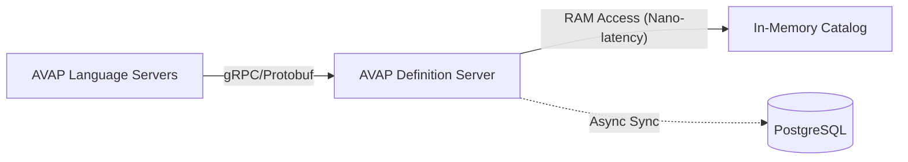

# AVAP Definitions Server

[](https://github.com/rafa-ruiz/AVAP_Definitions_Server/actions/workflows/ci.yml)


The **AVAP Definition Server** is the central intelligence unit of the AVAP ecosystem. It acts as the high-performance authoritative server responsible for managing, securing, and serving command logic (`obex_dapl_functions`) to distributed execution nodes via **gRPC**.

Designed for **Enterprise Scale**, it decouples data persistence from execution, ensuring that no external runtime ever accesses the database directly.

---

## System Documentation

We maintain strict documentation standards. Please refer to the specific guides below for deep dives:

| Document | Description | Target Audience |
| :--- | :--- | :--- |
| [**Architecture**](./docs/ARCHITECTURE.md) | Zero-IO design, Split-Plane pattern, and Data Flow diagrams. | Architects, Leads |
| [**Performance**](./docs/PERFORMANCE.md) | Benchmarks (37k RPS), Memory Management, and Optimization flags. | SRE, DevOps |
| [**Security**](./docs/SECURITY.md) | Zero-Trust implementation, DB Isolation, and Auth protocols. | Security, Compliance |
| [**Production**](./docs/PRODUCTION.md) | Kubernetes/Docker deployment, CI/CD pipelines, and Operational manuals. | DevOps, SysAdmins |

---

## Architecture Role

This service implements the **"Definition Server"** pattern in our decoupled architecture. It is the sole guardian of the intellectual property stored in the database.



### Key Responsibilities
1.  **Data Sovereignty**: Manages the `obex_dapl_functions` and `avap_bytecode` tables.
2.  **High-Speed Serving**: Uses native Node.js gRPC and an **In-Memory** strategy to serve definitions instantly (Zero-IO).
3.  **Access Control**: Validates which execution nodes are permitted to request logic using Metadata Auth.
4.  **Interface Enforcement**: Ensures all served definitions adhere to the strict Protobuf contract.

---

## Performance Features

* **Zero-Copy Networking**: Leveraging pure gRPC buffers to minimize CPU cycles.
* **In-Memory Architecture**: The entire catalog resides in RAM, eliminating Database I/O for read operations.
* **V8 Tuning**: Optimized Garbage Collection flags for high-throughput, low-latency scenarios.
* **Benchmark**: Proven to sustain **+37,000 RPS** on local hardware and **+6,500 RPS** on constrained CI environments.

---

## Getting Started

### Prerequisites
* **Node.js 22+**
* **PostgreSQL 15+** (or via Docker)

### Local Development

1.  **Clone & Install:**
    ```bash
    git clone [https://github.com/rafa-ruiz/AVAP_Definitions_Server.git](https://github.com/rafa-ruiz/AVAP_Definitions_Server.git)
    cd AVAP_Definitions_Server
    npm install
    ```

2.  **Start Services (DB + API):**
    ```bash
    docker compose up --build
    ```

3.  **Verify Health:**
    Since this is a gRPC server, use `grpc_health_probe` or our test script:
    ```bash
    npm test
    ```

---

## Security Standards

This repository adheres to **Tier-1 Security Protocols**:
* **Isolation**: This service is the *only* entity with database credentials.
* **Read-Only Exposure**: The API exposes read-only endpoints for execution nodes, preventing accidental logic modification via the execution layer.
* **Input Sanitization**: All incoming parameters are validated against strict regex before querying the cache.

For deep architectural details, see [ARCHITECTURE.md](./docs/ARCHITECTURE.md).

---

## License

Proprietary Software. Unauthorized access, distribution, or copying is strictly prohibited.