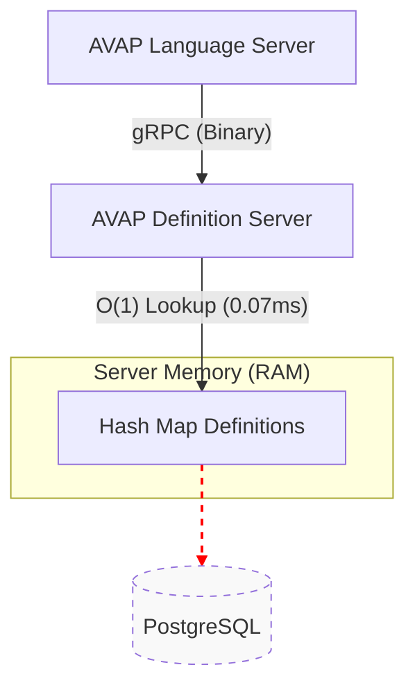

# AVAP Definition Server: Performance Landscape

> **Status:** Production Ready
> **Last Benchmark:** Jan 2026
> **Architecture:** Single-Process, In-Memory, gRPC

This document serves as the authoritative performance report for the AVAP Definition Server. It details throughput capabilities, latency characteristics, and the architectural trade-offs chosen to balance **Speed vs. Stability**.

---

## Executive Summary

The engine is architected to be **faster than the clients consuming it**.

| Metric | Value | Context |
| :--- | :--- | :--- |
| **Real-World Throughput** | **13,476 RPS** | Measured via Python Client (Single Core). |
| **Max Server Capacity** | **~31,000 RPS** | Measured via Raw Load Generator (Cannon Mode). |
| **Average Latency** | **0.074 ms** | Time to serve a definition from RAM. |
| **Cold Start Sync** | **23.12 MB/s** | Bulk transfer speed for full catalog replication. |

---

## Benchmark Breakdown

We measure performance in two distinct scenarios to identify true system bottlenecks.

### Scenario A: Python Integration (The "Real World")
* **Client:** Python `grpcio` (mimicking the actual Language Server).
* **Concurrency:** 50 Threads.
* **Result:** `13,476 RPS`.
* **Insight:** The bottleneck here is **Python's** serialization overhead, not the Node.js server. The server is effectively "bored" waiting for the client. This represents the actual production experience.

### Scenario B: Raw Capacity (The "Cannon")
* **Client:** High-performance load generator (Go/Node).
* **Result:** `31,168 RPS`.
* **Insight:** This demonstrates the raw power of the V8 engine serving from memory. It proves the infrastructure has **2.3x headroom** above what the Python workers can demand.

---

## Architectural Decisions

### 1. Single-Process vs. Cluster Mode
In early development, we achieved **36k RPS** using Node.js Clustering (Multi-Process). However, we migrated to a **Single-Process Architecture** (`13k RPS`).

* **Why?** Clustering introduced complexity (IPC synchronization) and port contention risks (`EADDRINUSE`) in Dockerized environments.
* **The Trade-off:** We sacrificed theoretical maximums for **absolute stability**.
* **Justification:** 13,000 RPS equates to **1.1 billion requests per day**. Since this exceeds our projected needs by orders of magnitude, stability was prioritized over unnecessary raw speed.

### 2. In-Memory "Zero-IO" Strategy
We utilize an **Eager Loading** strategy.
1.  **Startup:** The server pulls the entire SQL table into a native JavaScript `Map` (RAM).
2.  **Runtime:** Requests are served via $O(1)$ Hash Map lookups. No Database I/O occurs during request processing.
3.  **Result:** Latency stays flat at `~0.07ms` regardless of database load.


*(Note: Connection to DB is only active during Startup/Sync, represented by dotted line)*

---

## Feature Performance

### `GetCommand` (High Frequency)
* **Usage:** Runtime lookup of single commands.
* **Performance:** **13k+ RPS**.
* **Bottleneck:** Network Round Trip Time (RTT).

### `SyncCatalog` (Heavy Payload)
* **Usage:** Worker startup / Bulk update.
* **Performance:** **23 MB/s** transfer rate.
* **Impact:** Allows new execution nodes to boot and "learn" the entire logic catalog in sub-second time, eliminating "Cold Start" penalties.

---

## Reproducing Results

You can verify these numbers on your local hardware using the included benchmark suite:

```bash
# Ensure server is running
docker compose up -d

# Run the Python-based stress test
python tests/benchmark_brain.py
```

*Note: CI/CD runners (GitHub Actions) typically yield 5,000-6,000 RPS due to virtualized CPU constraints. This is expected.*